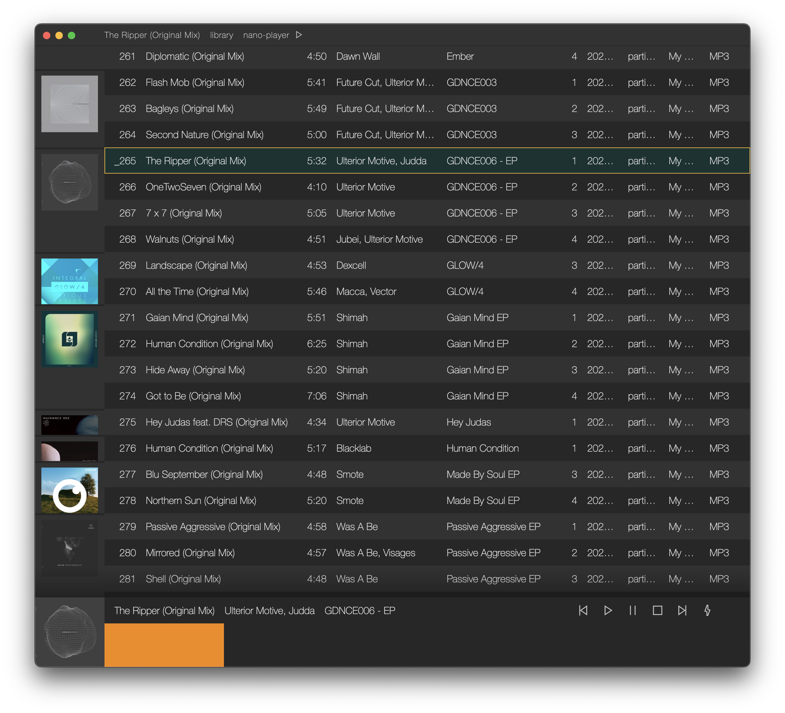
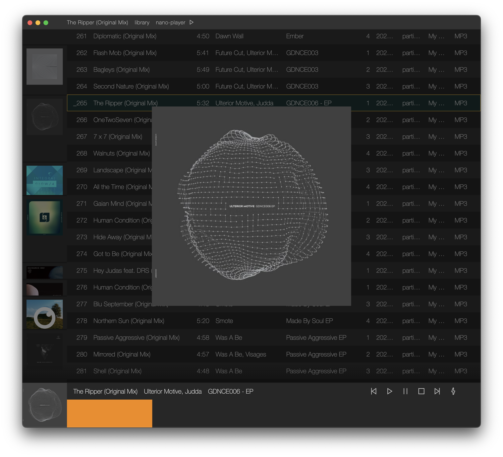
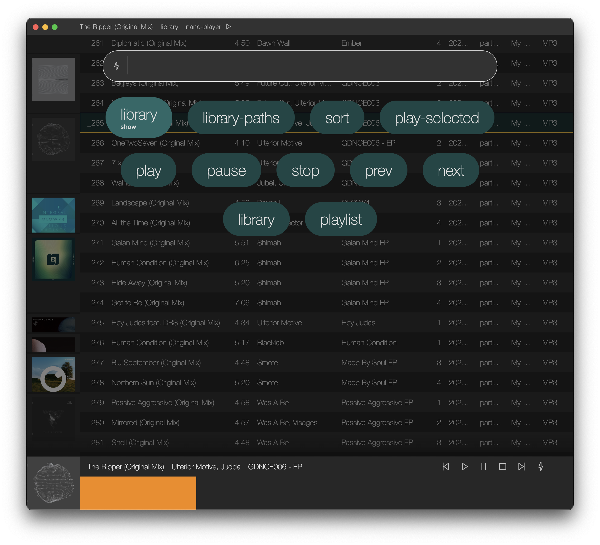

# nano-player

A TypeScript/Electron based audio player using IndexedDB for snappy queries and indexing. Interactions are optimized for trackpad, with a command palette system for accessing lesser used features.

Some highlight features:

- Low distraction interface
- Add folders for automatic indexing
- Quick access to search and filtering
- Custom sort orders and groupings (WIP)
- Playlists
- Command palette (extensibility WIP)

To come:

- Batch transcoding
- Metadata editing

